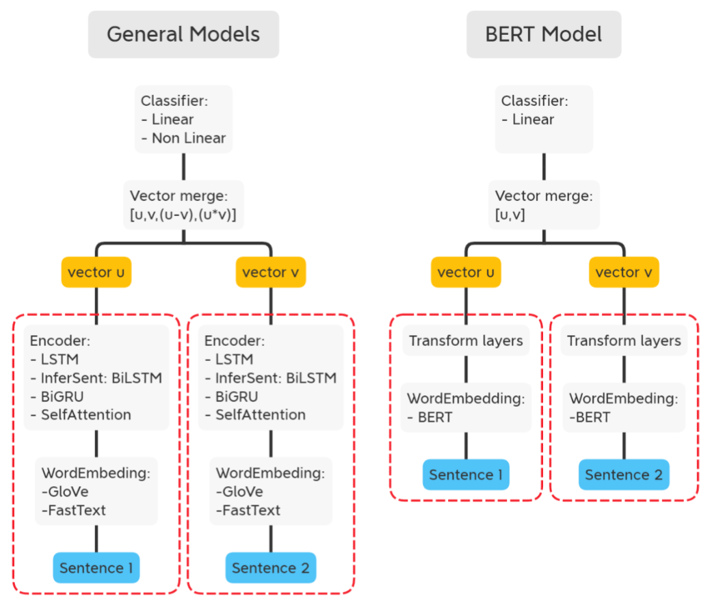

# 🧠 Natural Language Inference: InferSent vs BERT (UCL MSc Project)

As part of my MSc in Data Science at UCL, I led a research project analyzing the performance and architecture of models designed for **Natural Language Inference (NLI)**, using the **MultiNLI corpus**.

We evaluated various encoder types (LSTM, BiLSTM, BiGRU, Self-Attention, and BERT) within a consistent architecture, focusing on:

- Sentence Embedding Methods: Classical word em via concatenation, subtraction, multiplication
- Classifier Structures: Linear and nonlinear laybeddings (GloVe, FastText) vs Transformer-based representations (BERT)
- Vector Merging Strategies: Combining embeddingsers, dropout, and layer depth

🧠 Key Outcomes:

- BERT outperformed other models by a large margin (+15% accuracy)
- Vector merging (e.g., using u*v, |u−v|) significantly boosted performance
- The classifier layer structure had minimal impact, emphasizing the importance of good encoders and merging blocks
- Statistical tests validated model differences (e.g., BiLSTM > BiGRU)

---

## 🧩 What is Natural Language Inference (NLI)?

NLI is the task of determining the **logical relationship** between a pair of sentences:

- **Premise**: The original sentence
- **Hypothesis**: A follow-up sentence that may be related to the premise
- **Label**: One of:
  - **Entailment** – Hypothesis must be true
  - **Contradiction** – Hypothesis cannot be true
  - **Neutral** – Hypothesis may or may not be true

Example:
> **Premise:** “The man is playing a guitar.”  
> **Hypothesis:** “A man is performing music.”  
> **Label:** Entailment

This task is foundational for sentence-level understanding and powers applications like:
- Fact-checking
- Conversational AI
- Semantic search

### 🖼️ NLI Training Workflow



---

## 📊 Key Results

| Encoder        | Matched | Mismatched |
|----------------|---------|------------|
| LSTM           | 63.25%  | 64.06%     |
| BiGRU          | 68.55%  | 67.99%     |
| BiLSTM         | 69.11%  | 69.02%     |
| Self-Attention | 69.44%  | 69.01%     |
| BERT (base)    | **83.29%** | **83.30%** |

- BERT outperforms all traditional encoders
- Merge vector strategy (|u−v|, u*v) strongly impacts performance
- Classifier design has **minimal impact** beyond a threshold

---

## 🧠 Core Learnings

- Quality of sentence encoders dominates downstream performance
- Vector merging is not just implementation detail—it drives the signal
- Even strong statistical models (like BiLSTM + FastText) fall behind pretrained Transformers
- Testing across *matched* and *mismatched* domains reveals robustness

---

## 📂 Repo Structure

```
nli-infersent-vs-bert/
├── Code/                  # Model implementations and training scripts
├── InferSenseNLI/         # Training logs, configs, checkpoints
├── report/
│   └── UCL_NLI_Report.pdf  # Full academic write-up
└── README.md              # This file
```

---

## 🧪 How to Run

### 1. Clone the repo
```bash
git clone https://github.com/agonzalezp2/nli-infersent-vs-bert
cd nli-infersent-vs-bert
```

### 2. Install dependencies (via `requirements.txt` or environment.yaml if provided)
```bash
pip install -r requirements.txt
```

### 3. Train & Evaluate
```bash
python train.py --model BiLSTM --embed fasttext
```

Or run evaluation on BERT baseline:
```bash
python train.py --model BERT --dataset MultiNLI
```

---

## 📘 References
- Williams, Adina et al. (2018). "A Broad-Coverage Challenge Corpus for Sentence Understanding through Inference."
- Conneau et al. (2017). "Supervised Learning of Universal Sentence Representations from Natural Language Inference Data."

---

## 👤 About Me
I'm Agustín, a Data & AI professional based in London. I build data products that balance academic rigor with business impact.

- [Portfolio](https://github.com/agonzalezp2/agustin-portfolio)
- [LinkedIn](https://www.linkedin.com/in/agustin-gonzalez-pozo)
