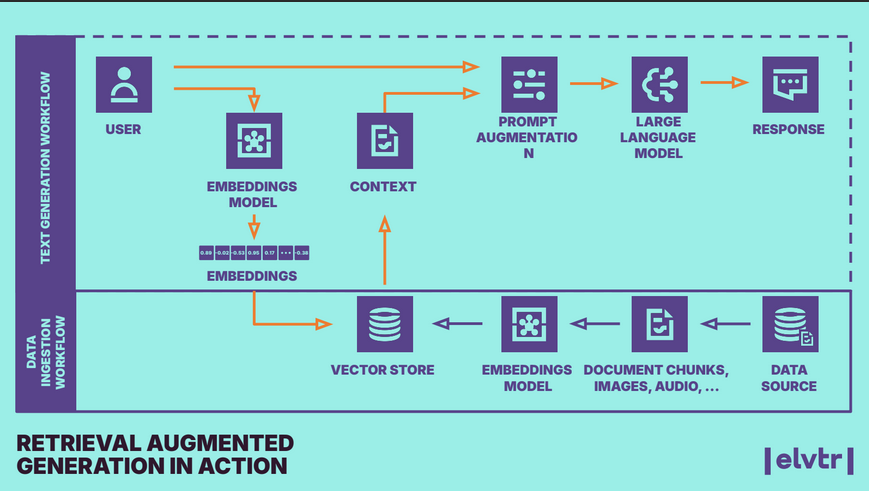

# 🧠 GenAI RAG System – Production-Ready Architecture with AWS Bedrock + LangChain

## 📍 Context

As part of the ELVTR AI Solution Architect certification (Sept–Nov 2024), I designed and deployed a **production-ready Retrieval-Augmented Generation (RAG)** solution. The project simulates an enterprise-grade GenAI use case, showcasing architecture design, prompt evaluation, and real-world deployment using **AWS Bedrock** and **LangChain**.

The goal was to create a **domain-aware chatbot** that answers user queries using custom knowledge sources, minimizing hallucinations and enabling reliable automation.

## ❓ Problem

Most LLM applications suffer from:
- ❌ Hallucinations
- ❌ Lack of domain-specific context
- ❌ Unclear evaluation metrics

I set out to build a **scalable RAG system** that could:
- Load and embed domain-specific documents
- Retrieve relevant context
- Generate high-quality responses
- Be evaluated for factuality and prompt performance

## 🛠️ Solution

### 🔧 Architecture Overview
>  

- **Data Source:** Proprietary domain documents (PDF/CSV/TXT)
- **Embeddings:** AWS Bedrock + Titan Embeddings
- **Retrieval:** Vector DB (FAISS)
- **LLM:** Claude via AWS Bedrock
- **Orchestration:** LangChain with custom retrieval chain
- **Evaluation:** Promptfoo for automated prompt benchmarking

### 🔄 Workflow
1. Load docs → chunk → embed → index
2. User query triggers retrieval
3. Context sent to LLM
4. Response evaluated via test cases + Promptfoo scoring

## 📈 Outcome

- ✅ Fully functioning end-to-end RAG demo app
- ✅ Deployed using AWS EC2 instance
- ✅ Presented to senior AI/ML engineers during final capstone review
- ✅ Received recommendation letter from course lecturer (Toby Fotherby, AWS)

## 💡 Reflection

This project solidified my ability to:
- Architect and deploy GenAI solutions in cloud environments
- Use prompt evaluation frameworks like **Promptfoo**
- Understand the balance between retrieval quality and generation performance
- Communicate technical architecture clearly to both engineers and business stakeholders

Next steps:
- Integrate API gateway for real-time usage
- Experiment with vector database alternatives (e.g. Pinecone, Weaviate)
- Explore use cases for customer support, document Q&A, and internal search


## 📂 Repo Structure

| File/Folder        | Description                                      |
|--------------------|--------------------------------------------------|
| `promptfoo.yaml`   | Config file for prompt evaluation                |
| `capstone_rag.py`  | Main RAG application using LangChain + Bedrock  |
| `rag_test_driver.py` | Command-line interface for RAG testing         |


## 🧰 Installation & Setup

### I. Installing the Capstone RAG Application

This brief guide is for installing the `capstone_rag.py` application. This process also installs `rag_test_driver.py`, and is intended for command-line usage.

#### Prerequisites

- `git` – e.g., `sudo yum install git`
- `python 3.9+` – check with `python3 --version`
- `aws` – AWS CLI & `boto3` configured (`aws configure`)  
- AWS Bedrock access enabled + Titan LLMs + Invoke API permissions

#### Steps

```bash
git clone https://github.com/toby-fotherby/elvtr-solution-architecture.git
cd elvtr-solution-architecture/Class-15/Capstone-Assignment-III/

python3 -m venv venv
source venv/bin/activate
pip install -r requirements.txt

python capstone_rag.py  # Initial test and FAISS index build
python rag_test_driver.py  # Lists usage options
python rag_test_driver.py llm_option_one prompt_option_one "your question here"
```

---

### II. Installing Promptfoo

Promptfoo is used to evaluate RAG responses end-to-end.

#### Prerequisites

Install Node.js (if not available):
```bash
curl -o- https://raw.githubusercontent.com/nvm-sh/nvm/v0.39.7/install.sh | bash
source ~/.bashrc
nvm install --lts
```

Then:
```bash
npm install -g promptfoo
promptfoo --version
```

#### Initialize & Configure Promptfoo

```bash
promptfoo init
cp promptfooconfig_capstone_starter.yaml promptfooconfig.yaml
```

(Optional) Export Anthropic API key:
```bash
export ANTHROPIC_API_KEY="sk-ant-..."
```

#### 🧪 Prompt Evaluation

Prompt quality is tested using [Promptfoo](https://promptfoo.dev/).  
The configuration lives in `promptfoo.yaml` and defines the input queries, expected behavior, and LLM settings.

```yaml
prompts:
  - name: "Simple Query"
    prompt: "What is the capital of France?"
    vars: {}
providers:
  - id: bedrock:claude
    config:
      region: eu-west-2
```

To run evaluations:

```bash
promptfoo eval promptfoo.yaml
```

---

## 📈 Why It Matters

- Shows how to combine **GenAI + prompt evaluation + cloud deployment**  
- Demonstrates architecture-level thinking beyond coding  
- Built with production considerations: testability, modularity, and scale

This project reflects my interest in **AI Product Innovation** and long-term goal of leading **data strategy & AI integration** at scale.

---

## 📬 Contact

- [LinkedIn](https://www.linkedin.com/in/agustin-gonzalez-pozo)  
- [Portfolio Projects](https://github.com/agonzalezp2/agustin-portfolio)  

> ⚡️ Built with curiosity.
